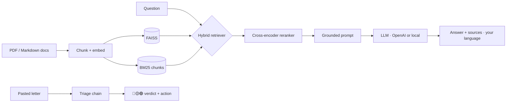

# 📄 AmtsHelfer — RAG assistant for German admin & health-insurance documents

Ask plain-language questions about your German paperwork — or paste a scary
letter and get a **red / yellow / green urgency verdict** telling you what to do
and by when. Answers are **grounded in your own documents**, retrieved with a
**hybrid BM25 + semantic search and a cross-encoder reranker**, and returned in
**your language**. Runs **fully local and free** (Ollama) or on OpenAI.


> Living in Germany as an international means drowning in official PDFs in a
> second language. AmtsHelfer turns that pile into something you can just *ask* —
> and tells you which letters actually need action *now*.

---

## What makes this more than a "chat with your PDF" clone

Plenty of demos stop at "it answers a question." AmtsHelfer adds the parts that
actually decide answer quality and usefulness:

- **🚦 Letter triage.** Paste a letter → structured verdict: urgency
  (red/yellow/green), the deadline if any, why, and the single next action.
  Any *Mahnung* is treated as red. This maps to the real fear: "is this urgent?"
- **🔎 Hybrid retrieval + reranking.** BM25 (keyword) catches exact form numbers
  and German compound terms that dense search misses; semantic search catches
  meaning; a cross-encoder reranker then orders the merged pool by true
  relevance. Each stage is flag-controlled and degrades gracefully.
- **🌍 Multilingual answers.** Retrieve from German documents, answer in English,
  Arabic, Turkish, Hindi, Ukrainian, and more.
- **📊 Evaluation harness.** Retrieval hit-rate + groundedness over a question
  set — because "trust me it works" isn't an answer in an interview.
- **🧱 A system, not a script.** Modular `src/`, a Streamlit UI *and* a FastAPI
  service, Docker, and CI. Grounded-or-refuse prompting throughout.

## Architecture



## Quickstart (free & local, ~5 min)

```bash
git clone https://github.com/udchawla02/amtshelfer-rag.git
cd amtshelfer-rag
python -m venv .venv && source .venv/bin/activate
pip install -r requirements-local.txt

# free local model  ->  https://ollama.com
ollama pull llama3.1:8b
ollama pull nomic-embed-text

cp .env.example .env          # default backend is 'ollama'
# add your own PDFs / .md files to data/documents/ (a sample ships already)

python -m src.ingest          # optional: built automatically on first run
streamlit run app.py          # UI with Ask + Triage tabs
```

Two dependency files: `requirements.txt` is the light set that runs anywhere
(and the only file Streamlit Cloud installs), while `requirements-local.txt`
adds Ollama and the local cross-encoder reranker.

Prefer OpenAI? Set `BACKEND=openai` and `OPENAI_API_KEY=...` in `.env`.

### Run it for free, including in the cloud

`BACKEND=gemini` uses Google AI Studio's free tier for **both** chat and
embeddings (no credit card). Get a key at <https://aistudio.google.com/apikey>:

```bash
BACKEND=gemini
GOOGLE_API_KEY=...
USE_RERANKER=false      # the cross-encoder needs torch; skip it in the cloud
```

### Deploy on Streamlit Community Cloud

Main file `app.py`, Python **3.11** under **Advanced settings**, and the three
settings above in **Secrets**. Streamlit Cloud always installs `requirements.txt`
and cannot be pointed at a different filename, which is why that file holds the
light set. The FAISS index is gitignored, so the app builds it on first run from
`data/documents/`.

## Use it as an API

```bash
uvicorn api:app --reload
curl -X POST localhost:8000/ask -H "Content-Type: application/json" \
  -d '{"question":"How long do I have to register my address?","language":"English"}'
curl -X POST localhost:8000/triage -H "Content-Type: application/json" \
  -d '{"text":"Sehr geehrte Damen und Herren, wir fordern Sie letztmalig auf ..."}'
```

## Evaluate retrieval quality

```bash
python -m src.evaluate        # retrieval hit-rate + groundedness over data/eval.jsonl
```

## Configuration (in `.env`)

| Setting | Meaning | Default |
|---|---|---|
| `USE_HYBRID` | BM25 + semantic ensemble | `true` |
| `USE_RERANKER` | cross-encoder rerank | `true` |
| `RERANKER_MODEL` | multilingual reranker | `BAAI/bge-reranker-base` |
| `TOP_K` | chunks sent to the LLM | `4` |
| `ANSWER_LANGUAGE` | default answer language | `English` |
| `BACKEND` | `openai` \| `ollama` \| `hf` | `ollama` |

## Project structure

```
amtshelfer-rag/
├── app.py              # Streamlit UI (Ask + Triage)
├── api.py              # FastAPI service (/ask, /triage)
├── config.py           # env-driven settings
├── src/
│   ├── models.py       # OpenAI / Ollama / HF factories
│   ├── ingest.py       # load -> chunk -> embed -> FAISS + BM25 chunks
│   ├── retriever.py    # hybrid retrieval + cross-encoder reranker
│   ├── rag.py          # grounded, multilingual RAG chain
│   ├── triage.py       # red/yellow/green letter triage
│   ├── formatting.py   # pure, tested helpers
│   └── evaluate.py     # eval harness
├── tests/              # offline unit tests (CI-friendly)
├── data/documents/     # your source files (sample FAQ included)
└── .github/workflows/  # lint + test CI
```

## Tech stack

Python · LangChain (LCEL) · FAISS · BM25 · cross-encoder reranker · Ollama /
OpenAI · Streamlit · FastAPI · Docker · GitHub Actions · pytest

## Roadmap

- [x] Hybrid retrieval (BM25 + dense) and cross-encoder reranking
- [x] Letter urgency triage
- [x] Multilingual answers
- [ ] Conversational memory (multi-turn follow-ups)
- [ ] OCR ingest so users can upload photos of letters
- [ ] RAGAS-based evaluation in CI

## Disclaimer

Educational project. Answers come from the documents you provide and are **not
legal or medical advice** — always confirm with the relevant office or professional.

## License

MIT © 2026 Udit Chawla
